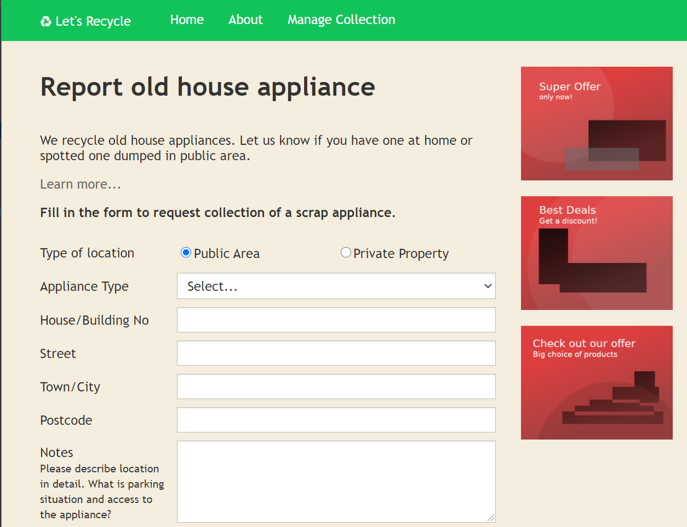

### Let's Recycle App

This app allows a customer to make an online request 
to AO for an appliance recycling collection from their 
home address. It is also possible to request a collection 
from a neighbourhood address for an appliance that has been abandoned.
 
 
The customer can choose a suitable collection time from a selection
of time slots which are algorithmically generated by matching 
AOs scheduled delivery routes to the recycling pick up address.  
 
 

 
 
The latest beta version of the app can be viewed at:
 
 
[Customer Page](https://lets-recycle-app.github.io)
 
 
[Admin Page](https://lets-recycle-app.github.io/#/admin)
 
 
The project story map is shown below.
 
 

 

### Technology Used

This project uses the following technology:

- ReactJS
- JavaScript (ES2015+)
- CSS
- Webpack
- Axios
- ESLint

It has been designed and built with mobile-first reponsive principles in mind.

### Other repos of this project

[Backend Lambda Functions](https://github.com/lets-recycle-app/lets-recycle-app-lambda)
 
[Backend Database Functions](https://github.com/lets-recycle-app/lets-recycle-app-backend)
